<!-- markdownlint-disable MD033 MD036 MD041 -->

<div align="center">
  <a href="https://v2.nonebot.dev/store"></a>
  <br>
  <p></p>
</div>

<div align="center">

# nonebot-plugin-npu

_✨ 西工大翱翔门户成绩监控插件，能获取成绩、排名、绩点，当出现新成绩时推送给使用者 ✨_

</div>

<p align="center">
  <a href="https://github.com/qllokirin/nonebot-plugin-npu/blob/master/LICENSE">
    
  </a>
  <a href="https://pypi.python.org/pypi/nonebot-plugin-npu">
    
  </a>
  
</p>
<p align="center">
  <a href="https://www.bilibili.com/video/BV1ga411T7mv">
    
  </a>
</p>
<h2 align="center">"摘下耳机时眼眶依旧会微红
戴上耳机依旧是你描绘的梦"
</h2>

# 📖 介绍

nonebot-plugin-npu，翱翔门户成绩监控插件，能获取成绩、排名、绩点，当出现新成绩时推送给使用者

- [x] 获取成绩、绩点、排名
- [x] 出现新成绩、新考试时推送
- [x] 排名变动时推送
- [x] 宿舍电费监控
- [x] 排考检测
- [x] 课表提取

# 💿 安装

<details>
<summary>法一：pip安装</summary>

* 1.激活python环境

  ```
  .\.venv\Scripts\activate   				(Windows)
  source \.venv\Scripts\activate			(Ubuntu)
  ```

* 2.安装

  ```
  pip install nonebot-plugin-npu
  ```
  
* 3.安装wkhtmltopdf

  ```
  打开https://wkhtmltopdf.org/downloads.html安装
  ```
  

打开 nonebot2 项目根目录下的 `pyproject.toml` 文件, 在 `[tool.nonebot]` 部分追加写入

```
plugins = ["nonebot-plugin-apscheduler", "nonebot-plugin-waiter", "nonebot-plugin-npu"]
```

</details>

<details>
<summary>法二：nb plugin安装方法</summary>

......

</details>

在`.env.prod`/`.env`中写入以下字段，也可不填，默认值如下

```
npu_check_time=60
npu_if_check_grades=true
npu_if_check_rank=false
npu_if_check_exams=true
npu_if_check_when_connect=false
npu_begin_check_hour=8
npu_end_check_hour=22
```

|        参数         |  值  |          说明          |
| :-----------------: | :--: | :--------------------: |
|   npu_check_time    | int  | 每多少分钟检测一次成绩 |
| npu_if_check_grades | bool |      是否检测成绩      |
|  npu_if_check_rank  | bool |      是否检测排名      |
| npu_if_check_exams  | bool |     是否检测新考试     |
| npu_if_check_when_connect  | bool |     当connect的是否执行一次检测     |
| npu_begin_check_hour | int | 起始检测时间，在x点之前不会检测 |
| npu_end_check_hour | int | 最末检测时间，在x点之后不会检测 |

> [!TIP]
>
> 记得配置[SUPERUSERS](https://nonebot.dev/docs/appendices/config#superusers)，当发生错误时会推送消息给超级用户
>
> 推荐设置[Command Start](https://nonebot.dev/docs/appendices/config#command-start-%E5%92%8C-command-separator)为`COMMAND_START=["/", ""]`，这样有`/`和没`/`都可以响应指令

# 🎉 使用

### 指令表

<details>
<summary>指令列表</summary>

|         指令          |   范围    |                           说明                           |           示例           |
| :-------------------: | :-------: | :------------------------------------------------------: | :----------------------: |
|       **/翱翔**       | 私聊/艾特 |                       登陆翱翔门户                       |   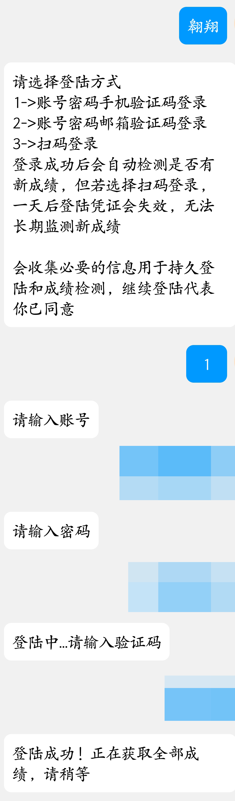   |
|       /翱翔成绩       | 私聊/艾特 |                     获取本学期的成绩                     | 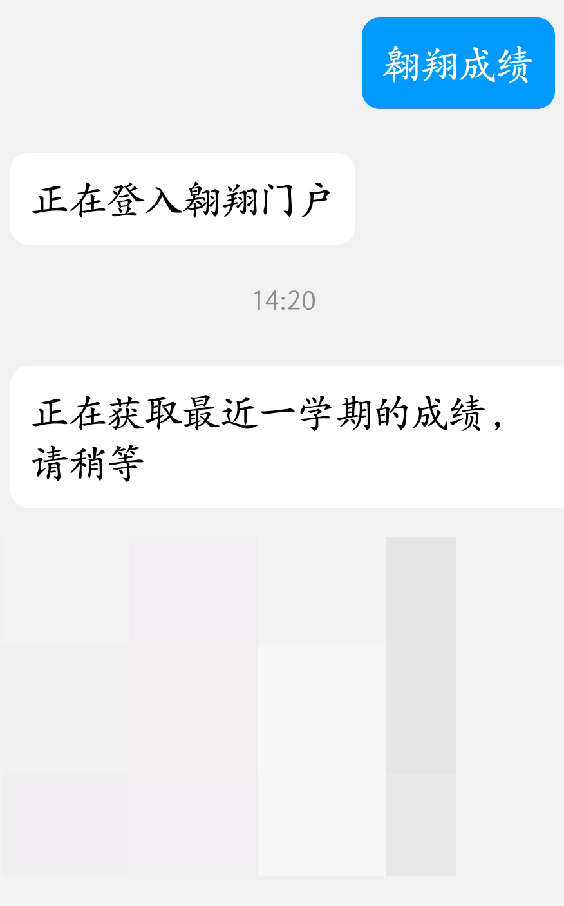 |
|       /翱翔排名       | 私聊/艾特 |                       获取排名信息                       |     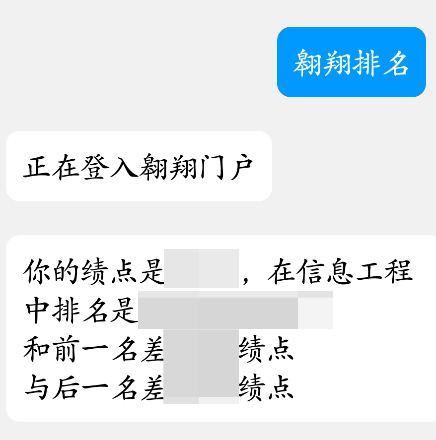     |
|       /翱翔考试       | 私聊/艾特 |                   获取未结束的考试信息                   |     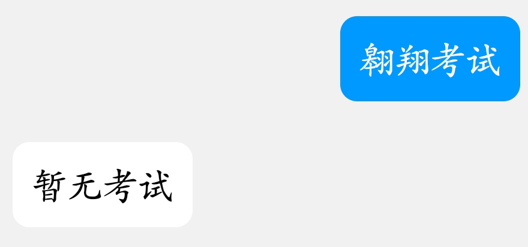     |
|       /翱翔课表       | 私聊/艾特 |           获取课表（需要搭配wake up软件使用）            |     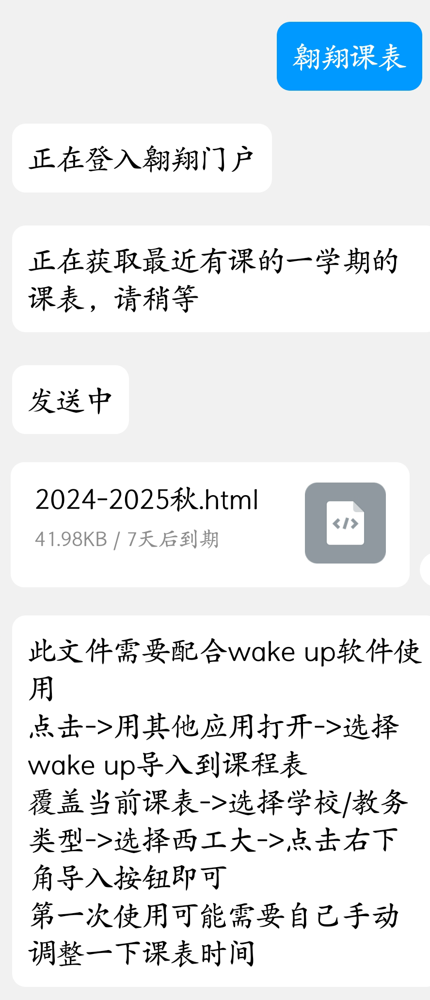     |
| /翱翔退出登陆（登录） | 私聊/艾特 |                         退出登陆                         |     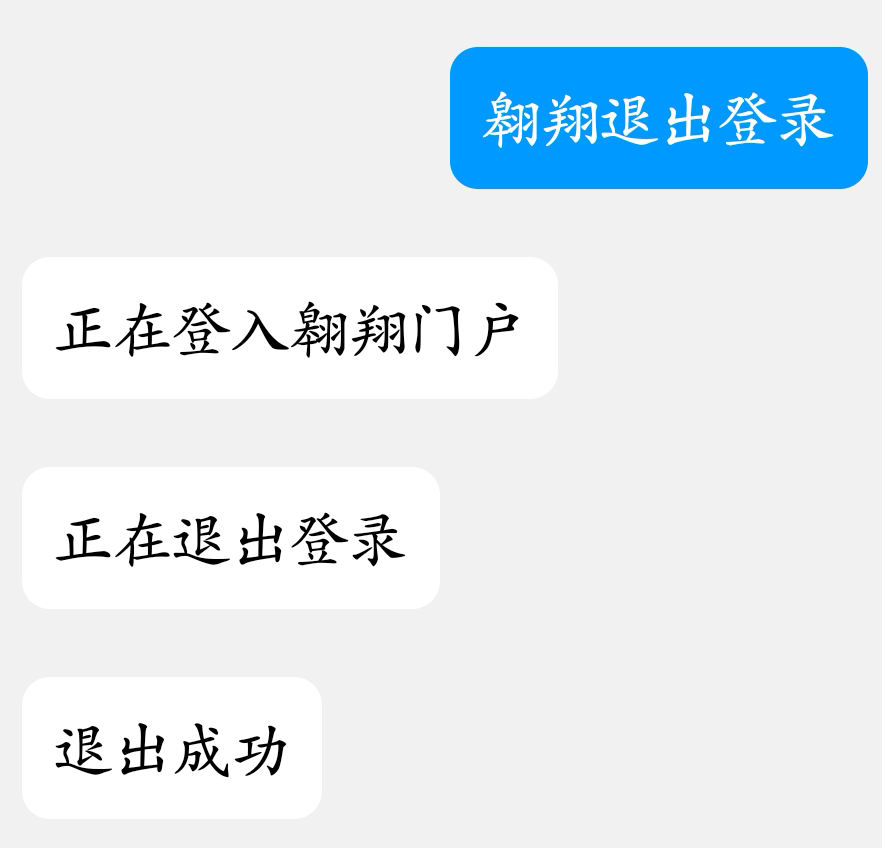     |
|     /翱翔全部成绩     | 私聊/艾特 |                       获取全部成绩                       |     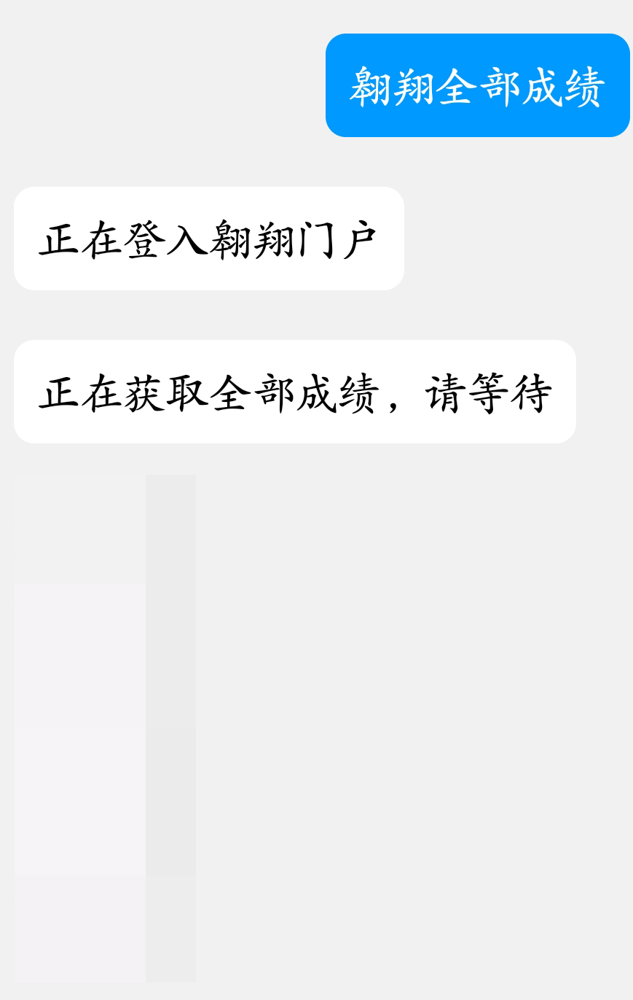     |
|     /翱翔全部考试     | 私聊/艾特 |                     获取全部考试信息                     |     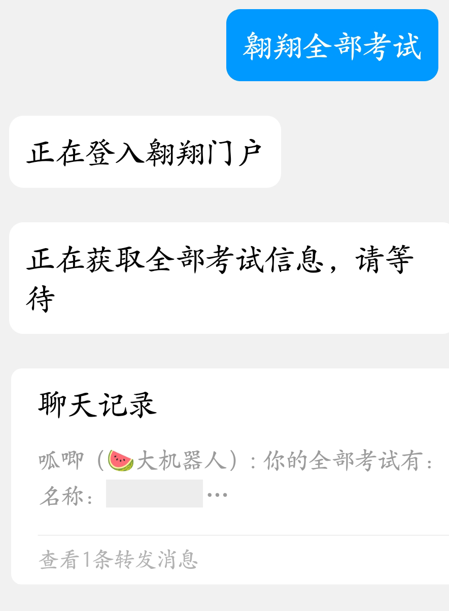     |
|  /翱翔加权百分制成绩  | 私聊/艾特 |                    计算加权百分制成绩                    |     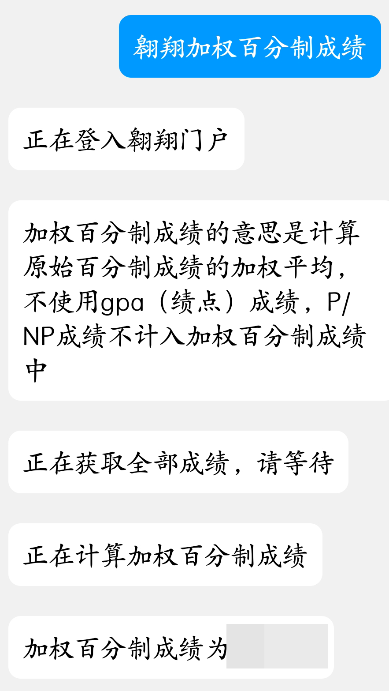     |
|     /翱翔电费绑定     | 私聊/艾特 | 绑定宿舍，当电费小于25时会推送消息，每天中午12点检测一次 |     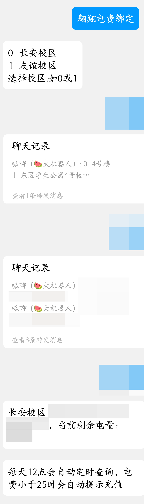     |
|     /翱翔电费查询     | 私聊/艾特 |                       查询当前电费                       |     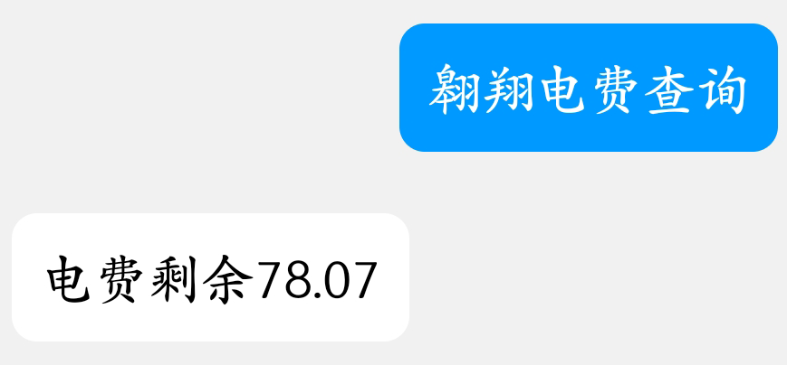     |
|     /翱翔电费解绑     | 私聊/艾特 |                       解除宿舍绑定                       |          |

</details>

# 致谢

翱翔门户登陆以及数据获取参考了：https://github.com/cheanus/Automation/blob/main/GradesMonitorLinux.py

README写法 [参考](https://github.com/A-kirami/nonebot-plugin-template/blob/master/README.md) [参考](https://github.com/WJZ-P/LiteLoaderQQNT-Echo-Message/blob/main/README.md)
